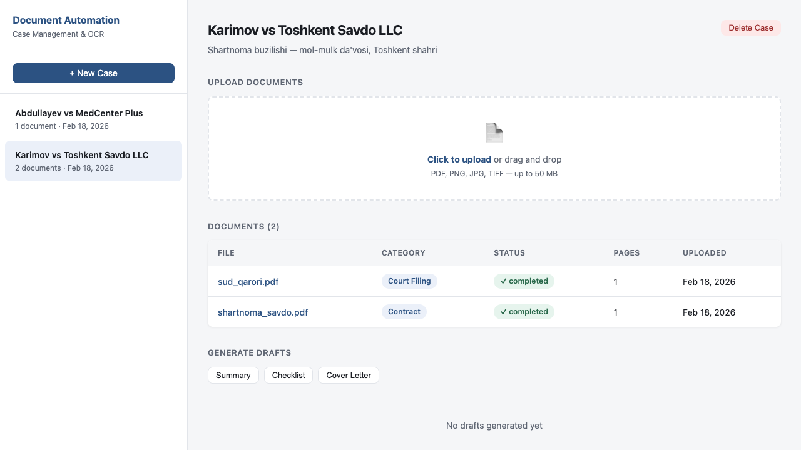
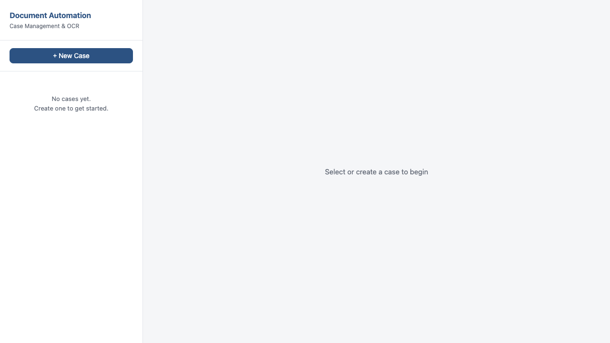
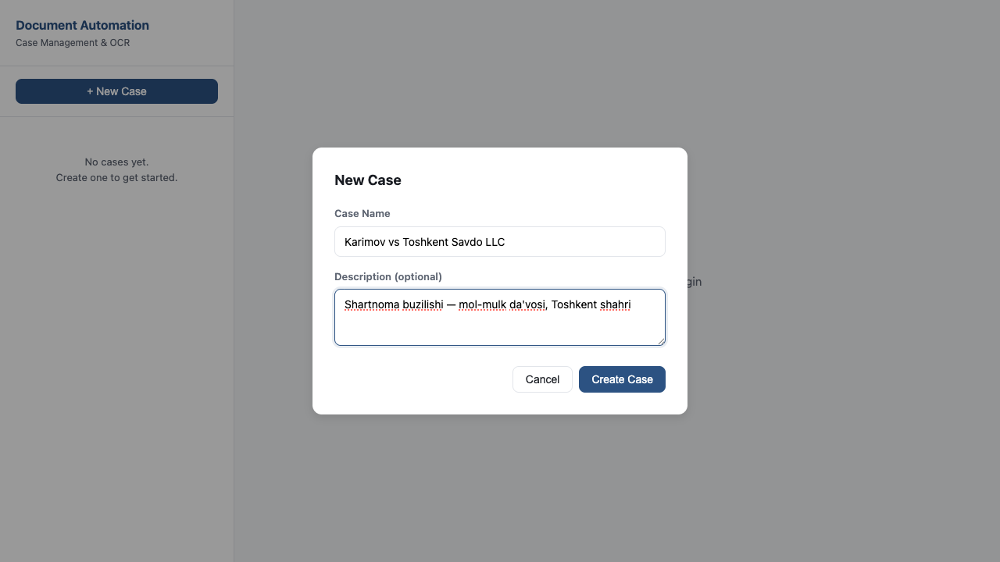
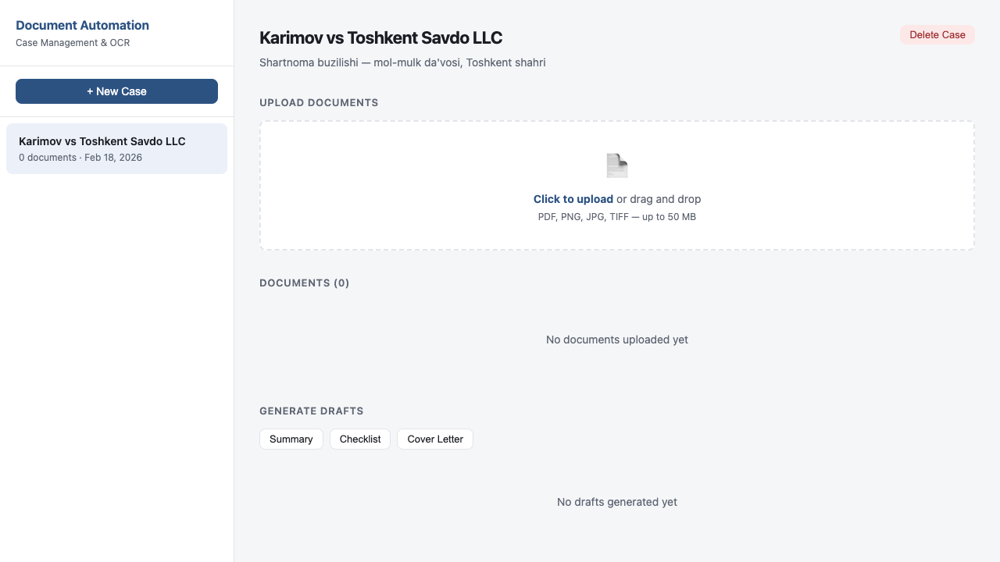
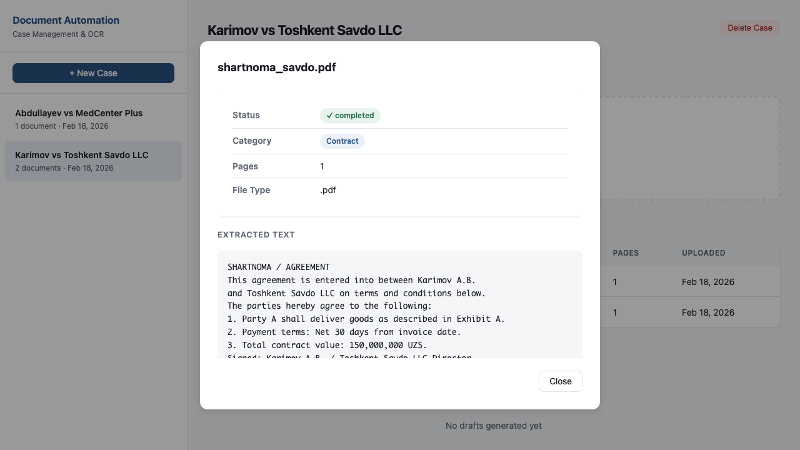
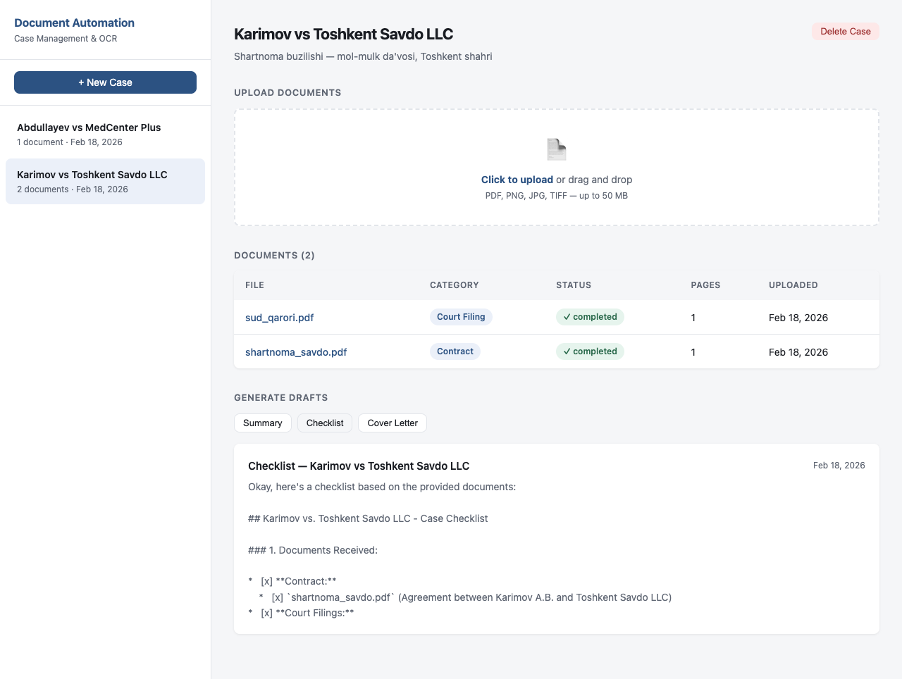
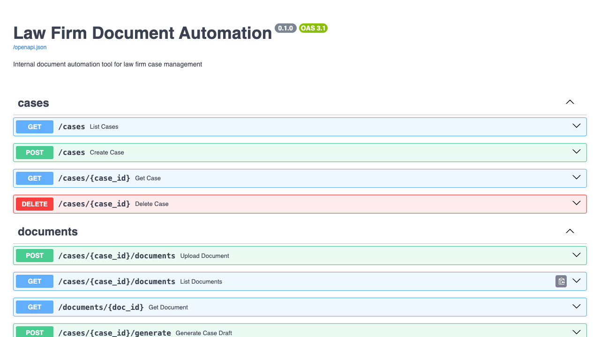

# Law Firm Document Automation

Internal automation tool for law firms to process document-heavy cases. Upload PDFs and scanned images, extract text via OCR, auto-classify documents, organize them into case folders, and generate drafts using AI.



## Features

- **Document Upload** — drag-and-drop or click to upload PDFs, PNGs, JPGs, TIFFs (up to 50 MB)
- **OCR Processing** — automatic text extraction from native PDFs (`pdfplumber`) and scanned documents (`Tesseract`)
- **AI Classification** — documents are automatically classified into categories: Contract, Court Filing, Deposition Transcript, Medical Record, Invoice, Correspondence, and more
- **Auto-Organization** — files are sorted into structured case folders by category
- **Draft Generation** — generate summaries, checklists, and cover letters from case documents using AI
- **Multi-Provider LLM** — supports Google Gemini, Anthropic Claude, and OpenAI
- **REST API** — full API with interactive Swagger documentation
- **Web UI** — clean, responsive interface for case management

## Screenshots

### Dashboard


### Create a New Case


### Case View with Upload Zone


### Documents with AI Classification


### Document Detail — Extracted Text


### AI-Generated Checklist


### Swagger API Documentation


## Quick Start

### Prerequisites

- Python 3.11+
- [Tesseract OCR](https://github.com/tesseract-ocr/tesseract) installed on your system
- [Poppler](https://poppler.freedesktop.org/) (for PDF-to-image conversion)

**macOS:**
```bash
brew install tesseract poppler
```

**Ubuntu/Debian:**
```bash
sudo apt install tesseract-ocr poppler-utils
```

### Installation

```bash
git clone git@github.com:sirliboyev-uz/lawdocs-automation.git
cd lawdocs-automation

python -m venv .venv
source .venv/bin/activate
pip install -r requirements.txt
```

### Configuration

```bash
cp .env.example .env
```

Edit `.env` and set your LLM provider:

**Google Gemini (default):**
```env
LLM_PROVIDER=gemini
GOOGLE_API_KEY=your-google-api-key
LLM_MODEL=gemini-2.0-flash
```

**Anthropic Claude:**
```env
LLM_PROVIDER=anthropic
ANTHROPIC_API_KEY=sk-ant-...
LLM_MODEL=claude-sonnet-4-20250514
```

**OpenAI:**
```env
LLM_PROVIDER=openai
OPENAI_API_KEY=sk-...
LLM_MODEL=gpt-4o-mini
```

### Run

```bash
uvicorn app.main:app --reload
```

Open [http://localhost:8000](http://localhost:8000) for the web UI, or [http://localhost:8000/docs](http://localhost:8000/docs) for the API documentation.

## How It Works

```
Upload → OCR/Extract → Classify → Organize → Generate
```

1. **Upload** — staff uploads PDFs or scanned images via the web UI or API
2. **Extract** — text is extracted from native PDFs; scanned documents go through Tesseract OCR
3. **Classify** — extracted text is sent to the LLM to determine document type (with keyword-based fallback)
4. **Organize** — files are moved into structured folders per case:
   ```
   storage/
   └── karimov_vs_toshkent_savdo_llc/
       ├── contracts/
       │   └── 2026-02-18_shartnoma_savdo.pdf
       ├── court_filings/
       │   └── 2026-02-18_sud_qarori.pdf
       └── medical_records/
           └── 2026-02-18_tibbiy_xulosa.pdf
   ```
5. **Generate** — create summaries, checklists, or cover letters from case documents using AI

## API Endpoints

| Method | Endpoint | Description |
|--------|----------|-------------|
| `GET` | `/health` | Health check |
| `POST` | `/cases` | Create a case |
| `GET` | `/cases` | List all cases |
| `GET` | `/cases/{id}` | Get case details |
| `DELETE` | `/cases/{id}` | Delete a case |
| `POST` | `/cases/{id}/documents` | Upload a document |
| `GET` | `/cases/{id}/documents` | List case documents |
| `GET` | `/documents/{id}` | Get document detail + extracted text |
| `POST` | `/cases/{id}/generate` | Generate a draft |
| `GET` | `/cases/{id}/drafts` | List generated drafts |

## Project Structure

```
lawdocs-automation/
├── app/
│   ├── main.py              # FastAPI entry point + static files
│   ├── config.py            # Settings (Pydantic, .env driven)
│   ├── database.py          # SQLAlchemy + SQLite
│   ├── models.py            # Case, Document, Draft models
│   ├── schemas.py           # Request/response schemas
│   ├── routers/
│   │   ├── cases.py         # Case CRUD endpoints
│   │   └── documents.py     # Upload, processing, draft generation
│   └── services/
│       ├── llm.py           # Unified LLM client (Gemini/Anthropic/OpenAI)
│       ├── ocr.py           # PDF parsing + Tesseract OCR
│       ├── classifier.py    # AI document classification
│       ├── organizer.py     # File organization into folders
│       └── generator.py     # Draft generation (summary/checklist/cover letter)
├── static/                  # Web UI (HTML/CSS/JS)
├── storage/                 # Organized document storage
├── requirements.txt
├── .env.example
└── .gitignore
```

## Tech Stack

| Layer | Technology |
|-------|-----------|
| Backend | FastAPI + Python |
| Database | SQLAlchemy + SQLite |
| OCR | Tesseract + pdfplumber |
| LLM | Gemini / Claude / OpenAI |
| Frontend | Vanilla HTML/CSS/JS |
| Task Queue | FastAPI BackgroundTasks |

## License

MIT
